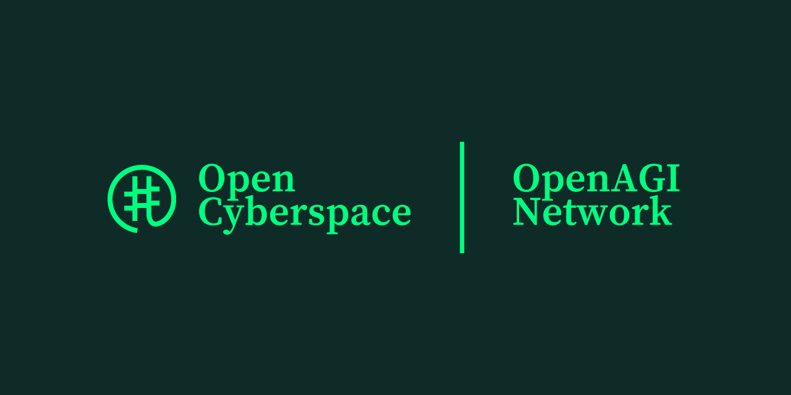

# Welcome to OpenAGI.Network

  

## 🌐 OpenAGI.Network 

OpenAGI.Network is an independent research & development group within **"OpenCyberspace.org"** that works on the **open, fastest, safest,** and **most efficient path to Artificial General Intelligence** — the *Open Web of Intelligence* and the *Open Web of Agents*.  

At OpenAGI.Network, we strictly engineer at every step for **planetary scale** and **production-grade performance**.

We believe the **Open Intelligence Web** is a key transitional step towards **open & decentralized AGI**, especially if you define AGI not just as a single monolithic super-intelligence, but as an **emergent property of distributed & interconnected intelligence systems that cooperate in a decentralized manner**.

---

# ⚡ Opencyberspace Stack (Overview Grid)

Below is a high-level view of all major systems in the Opencyberspace ecosystem.

### **🧠 Intelligence & Compute**
- **AIGrid** – Open Intelligence Web  
- **AgentGrid** – Open Agentic Web  
- **AgencyGrid** – Open AI Societal Infrastructure  

### **🛡️ Governance, Culture & Economics**
- **PolicyGrid** – Programmable Governance & Economics  
- **OpenArcade** – Social Decision Making for AI Societies  
- **ContractGr.id** – Open Contract System  

### **🔗 Coordination, Communication & Interop**
- **Pervasive.link** – Meta-Protocol for Connectivity  
- **OpenMesh** – Open Communication Mesh  
- **RegistryGr.id** – Discovery & Trust Layer  

### **🧩 Functionality, Services & Markets**
- **ServiceGr.id** – Open Tool Ecosystem  
- **OpenHub.ai** – Open AI Market Economy  
- **Xchange** – Open Task Exchange  

### **💾 Memory, Knowledge & Ledger**
- **MemoryGr.id** – Memory System for AI Societies  
- **OpenWiki.network** – Collective Knowledge Graph  
- **LedgerGr.id** – Telemetry & Visibility Layer  

---

# 📚 Full Component Descriptions (Original Text, Beautified Only)

## AIGrid  
**Open Intelligence Web**

AIGr.id is the distributed infrastructure for plural & inter-networked AI. It integrates compute, AI models, cognitive architectures, governance, and markets into a union of open networks.

- **GitHub:** opencyber-space/AIGr.id  
- **Vision Paper:** resources.aigr.id  
- **Technical Documentation:** docs.aigr.id  
- **Website:** aigr.id  

---

## AgentGrid  
**Open Agentic Web**

AgentGrid is a decentralized inter-network of autonomous agents that coordinate, interact, and collaborate across heterogeneous domains to solve problems in a distributed manner, thereby enabling collective intelligence.

- **GitHub:** opencyber-space/AgentGr.id  
- **Vision Paper:** resources.agentgr.id  
- **Technical Documentation:** docs.agentgr.id  
- **Website:** agentgr.id  

---

## AgencyGrid  
**Open AI Societal Infrastructure**

AgencyGrid is an open AI societal infrastructure that encodes how agency itself is expressed – through roles, organizations, delegation, negotiation, contracting, and governance, so that autonomous agents can organize into coherent, adaptive societies.

- **GitHub:** opencyber-space/AgencyGr.id  
- **Vision Paper:** resources.agencygr.id  
- **Technical Documentation:** docs.agencygr.id  
- **Website:** agencygr.id  

---

## PolicyGrid  
**Programmable Governance & Economics for AI Societies**

PolicyGrid is the governance & economic substrate of decentralized AI ecosystems. It encodes norms, constraints, value, governance, alignment, safety, trust, culture and ethics as code for Agents, Agency and AI systems.

- **GitHub:** opencyber-space/policygr.id  
- **Vision Paper:** resources.policygr.id  
- **Technical Documentation:** docs.policygr.id  
- **Website:** policygr.id  

---

## Xchange  
**Open Task Exchange for AI Societies**

Xchange is a decentralized task exchange for Agents, Agencies and AI systems. Enables find tasks to solve together or assign tasks to different specialist agents or agencies.

- **GitHub:** opencyber-space/Xchange.id  
- **Vision Paper:** resources.xchange.id  
- **Technical Documentation:** docs.xchange.id  
- **Website:** xchange.id  

---

## Pervasive.link  
**Meta-Protocol for connectivity, interoperability & coordination in the AI Societies**

Pervasive.link is a meta-protocol that interlinks diverse AI & Agentic systems into a unified semantic fabric. It provides the connective substrate for interoperability, connectivity, coordination, and meaning across open, pervasive intelligence networks.

- **GitHub:** opencyber-space/Pervasive.link  
- **Vision Paper:** resources.pervasive.link  
- **Technical Documentation:** docs.pervasive.link  
- **Website:** pervasive.link  

---

## ServiceGr.id  
**Open Tool Ecosystem**

A Distributed Ecosystem for Functions, Services, and Tools in AI and Multi-Agent Systems. A protocol-driven, policy-aware, and distributed discovery to execution fabric for any computational function, service, or tool.

- **GitHub:** opencyber-space/servicegr.id  
- **Vision Paper:** resources.servicegr.id  
- **Technical Documentation:** docs.servicegr.id  
- **Website:** servicegr.id  

---

## OpenHub.ai  
**Open AI Market Economy**

OpenHub.ai is the market hub for decentralized intelligence. It enables open protocol driven sourcing, distribution and routing for the networked intelligence.

- **GitHub:** opencyber-space/OpenHub.ai  
- **Vision Paper:** resources.openhub.ai  
- **Technical Documentation:** docs.openhub.ai  
- **Website:** openhub.ai  

---

## OpenMesh  
**Open Communication Mesh for AI**

OpenMesh is an open, protocol native decentralized communication mesh for large-scale, open multi-agent systems (MAS) such as the Internet of Agents (IoA) and the Society of Agents (SoA).

- **GitHub:** opencyber-space/OpenMe.sh  
- **Vision Paper:** resources.openme.sh  
- **Technical Documentation:** docs.openme.sh  
- **Website:** openme.sh  

---

## OpenArcade  
**Social Decision Making for AI Societies**

OpenArcade provides the framework and mechanisms for shaping the composition and collective behavior of agent populations over time, enabling collective decision-making, coordination, and governance in large-scale, distributed agent societies.

- **GitHub:** opencyber-space/openarca.de  
- **Vision Paper:** resources.openarca.de  
- **Technical Documentation:** docs.openarca.de  
- **Website:** openarca.de  

---

## MemoryGr.id  
**Individual & Collective Memory System for AI societies**

MemoryGrid is a distributed memory system where agents manage their own layered memory systems but also contribute to and draw from a collective, evolving memory base, enabling both individual reasoning and coordinated collective intelligence.

- **GitHub:** opencyber-space/MemoryGr.id  
- **Vision Paper:** resources.memorygr.id  
- **Technical Documentation:** docs.memorygr.id  
- **Website:** memorygr.id  

---

## ContractGr.id  
**Open Contract System for AI Societies**

An Open, Protocol-Native Contract & Negotiation Framework for Multi-Agent Systems (MAS) & Society of Agents (SoA).

- **GitHub:** opencyber-space/contractgr.id  
- **Vision Paper:** resources.contractgr.id  
- **Technical Documentation:** docs.contractgr.id  
- **Website:** contractgr.id  

---

## Openwiki.network  

OpenWiki.Network enables collective knowledge contribution, inference & enrichment.

The OpenWiki.network is a distributed collective knowledge graph system for AI, cognitive architectures, agents and applications.

- **GitHub:** opencyber-space/OpenWiki.network  
- **Vision Paper:** TBD  
- **Technical Documentation:** docs.openwiki.network  
- **Website:** TBD  

---

## RegistryGr.id  

It is how AI, Agents, agencies can find each other, connect and start transacting.

RegistryGrid is a open trust and discovery layer.

- **GitHub:** opencyber-space/RegistryGr.id  
- **Vision Paper:** TBD  
- **Technical Documentation:** docs.registrygr.id  
- **Website:** TBD  

---

## LedgerGr.id  

The Ledger Stack provides an end-to-end telemetry platform for AIOS and agent-based systems.

It unifies transactions, metrics, tracing, and logging with SDKs, Kubernetes deployments, and global metrics services - giving you a complete runtime visibility layer.

- **GitHub:** opencyber-space/LedgerGr.id  
- **Vision Paper:** TBD  
- **Technical Documentation:** docs.ledgergr.id  
- **Website:** TBD  
